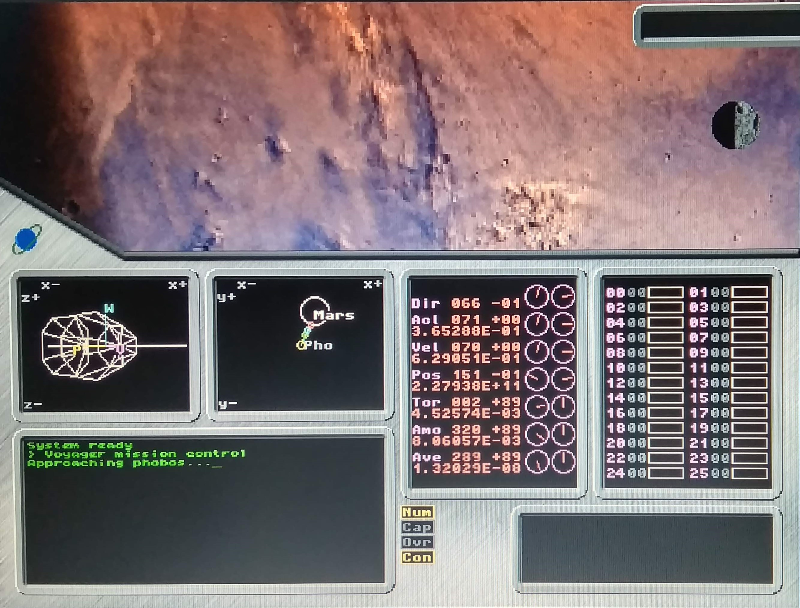
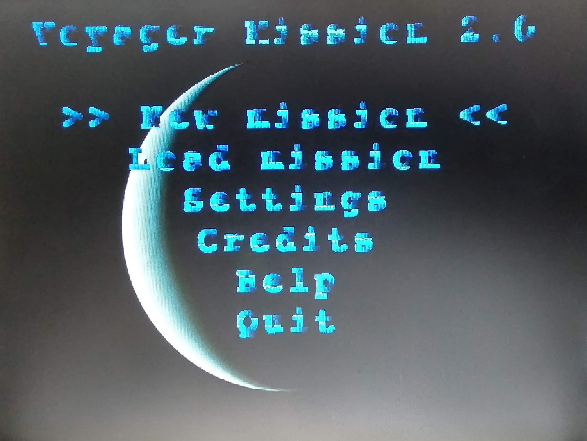
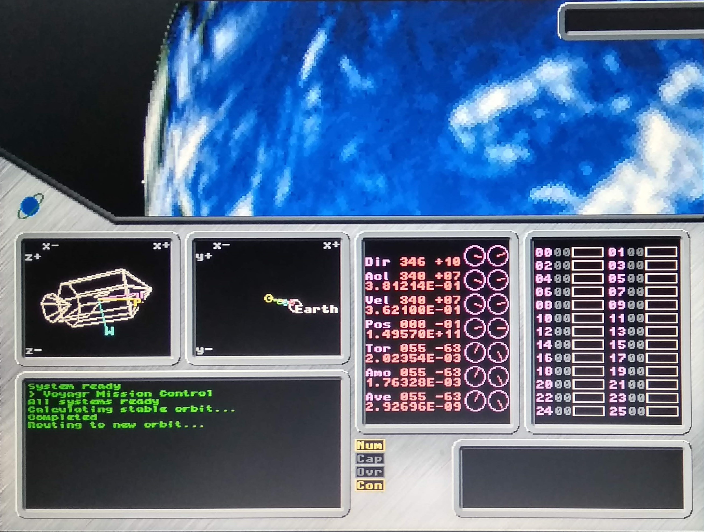
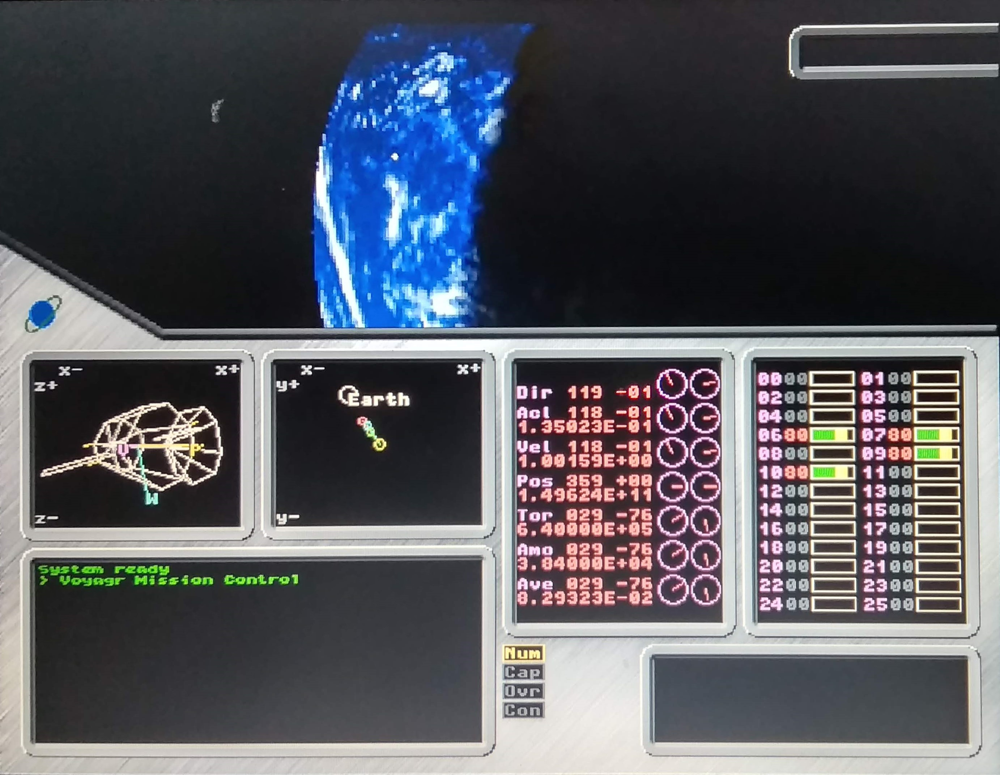

# Voyager Mission

**Spacecraft simulator on the solar system**

This is an unfinished work, it is a spacecraft simulator on the solar system.
It is created entirely using C languaje and uses svgalib graphics library for linux, it is only working on linux.

The application uses old style computer graphics, al rendering and 3D graphics are made with CPU computing all pixels one by one
(I mean, it does not use OpenGL or other 3D graphic libraries).

The simulation includes 71 celestial bodies counting planets and satellites. 20 of them are rendered with surface images available on internet.									
The background is also filled with stars comming from a 1600 star catalog.

The spacecraft is simulated a set of points that act as a rigid solid. Some of the points of the spacecraft have engines attached that produce propulsion or rotation of the spacecraft. This is controlled with the keyboard.

On the screen the application displays the following things:

- Outside window: The visible objects on the rendered universe are displated here, this includes, planets, satellites and stars.

- Spacecraft cockpit panels:
  - Spacecraft orientation plus velocity and acceleration vectors
  - Solar system 2D map, showing nearby celestial bodies 
  - Spacecraft state information (orientation, velocity, accereration, torque, angular monentum and velocity
  - Power of of all the engines

## Screenshots

Main menu:

Orbiting Earth:

Earth and Moon:

Mars and Phobos:

